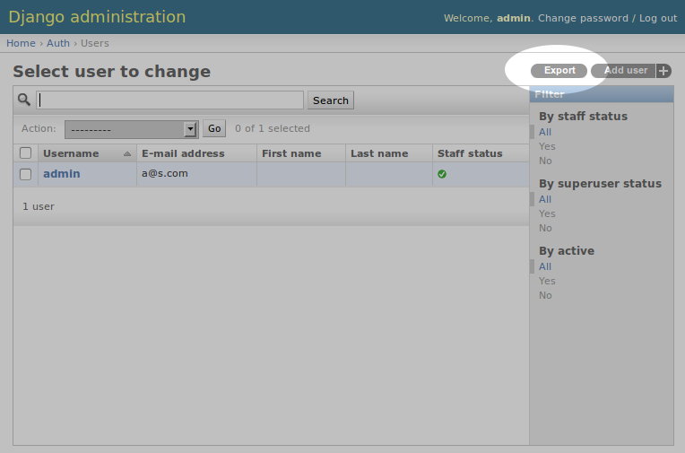

Django Export
=============
**Django app allowing for filtered exporting of model object data.**

.. image:: https://travis-ci.org/praekelt/django-export.svg
    :target: https://travis-ci.org/praekelt/django-export

django-export allows you to export model objects in a wide range of serialized formats (JSON, CSV, XML, YAML). Exports can be filtered and ordered on any of the particular model's fields.

django-export utilizes `django-object-tools <http://pypi.python.org/pypi/django-object-tools>`_ to hook into Django's admin interface and take care of user permissions.

.. contents:: Contents
    :depth: 5

Installation
------------

#. Install ``django-object-tools`` as described `here <http://pypi.python.org/pypi/django-object-tools#id3>`_.

#. Install or add ``django-export`` to your Python path.

#. Add ``export`` to your ``INSTALLED_APPS`` setting.

#. Optionally for exporting in CSV you need to add ``export.serializers.csv_serializer`` to your ``SERIALIZATION_MODULES`` setting, i.e.:

   .. code-block:: python

    SERIALIZATION_MODULES = {
        'csv': 'export.serializers.csv_serializer'
    }

Usage
-----

Once installed you should see an **Export** object tool enabled on all admin change list views.

If you don't see the tool make sure the logged in user has the appropriate export user permission assigned (or set user as superuser).

Clicking the **Export** tool link takes you to an export page on which you can specify format, ordering and filtering of the objects you want to export. The export is delivered as a download in whichever format you select.
